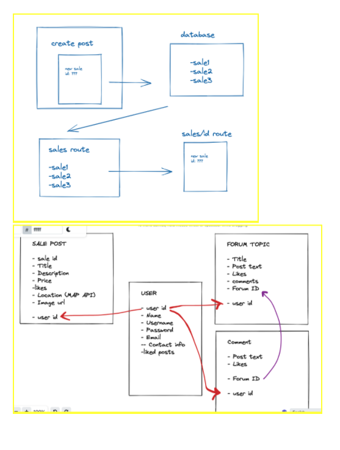

# ga-list-api


## Purpose of this api
To serve data to the main ga-list application 

## Explanations of the technologies used
The backend was bulit with MongoDB, Express & Node


<!-- ## A couple paragraphs about the general approach you took -->


## Dependencies

```
"dependencies": {
    "bcryptjs": "^2.4.3",
    "cors": "^2.8.5",
    "dotenv": "^10.0.0",
    "express": "^4.17.1",
    "faker": "^6.6.6",
    "jsonwebtoken": "^8.5.1",
    "mongoose": "^6.0.7",
    "passport": "^0.5.0",
    "passport-jwt": "^4.0.0"
  }
  ```

## ERD & WIREFRAME



## USER STORIES
### As a user I want to...
1. Access the home page (without logging in).
2. To browse listings (without logging in).
3. To log in (optional).
4. To create and manage my own posts (have to be logged in).

### Additional details
- Who this is for: 
- What this is for: 
- Why: 

## Code Snippets
### Jobs Schema
```
const mongoose = require("mongoose");

const JobsSchema = new mongoose.Schema({
    title: { type: String, required: true },
    description: String,
    payment: String,
    contact_info: String,
    location: String,
});

const Jobs = mongoose.model("Jobs", JobsSchema);

module.exports = Jobs; 
```
### Jobs Display
```
router.get("/", async (request, response) => {

    console.log(request.body)
    response.send('ok');

    try {
        const jobsArray = await Jobs.find({});
        response.json({ jobsArray });
    } catch (error) {
        response.status(500).send(error);
    }
});
```


## Descriptions of any unsolved problems or major hurdles your team had to overcome.
- Using Github Collaborations for the first time

